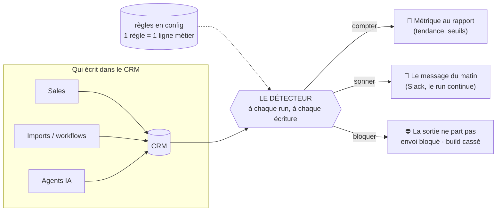

# 2b — Le détecteur de fumée pour CRM

*Réponse au volet 2b du challenge (« l'outil GTM que tu as toujours voulu avoir »). Le livrable demandé : un raisonnement + un schéma + en option un prototype rugueux. Les trois sont ici — la V0 tourne dans `filet/`.*

## Le problème

Ton CRM peut mentir sans que rien ne s'allume. Il s'ouvre, les filtres répondent, les chiffres s'affichent. Et ils sont faux. Dans le dataset du challenge, ça faisait 8 ans : **32 % de doublons** (30 000 fiches pour 20 519 entreprises réelles), du chiffre d'affaires qui comptait des clients partis. Personne n'a rien vu.

Le marché ne propose que deux parades : la validation à la saisie (un champ mal formaté) et l'audit périodique — mensuel ou trimestriel, c'est le rythme que les vendeurs d'outils recommandent eux-mêmes. Entre les deux, rien ne surveille en continu. Et surtout : **rien ne bloque**. L'envoi vers un désabonné part, puis un rapport le déplore trois semaines plus tard.

## Ce que fait l'outil

Il ne nettoie rien. **Il surveille et il gueule.** Chaque matin, un message :

> « Hier, 400 fiches sont entrées. 60 sont des doublons. Ton chiffre d'affaires a pris 200 000 € alors que tu n'as signé personne. »

Et pour les fautes à zéro doute — un désabonné dans une liste d'envoi, un bot dans les scores, un churné qui porte un deal non arbitré — il ne gueule pas : **il bloque la sortie**. C'est la différence avec tout ce qui existe : le détecteur n'écrit pas un rapport, il arrête l'envoi.

Chaque règle s'écrit **en une ligne de langage métier**, dans une config (« un désabonné ne reçoit jamais un envoi »). Pas de SQL, pas de notebook : la personne qui possède la règle est un RevOps, pas un data engineer. Trois réactions graduées : `compter` (métrique), `sonner` (alerte), `bloquer` (exit 1, la sortie ne part pas).

**Aucune règle n'est inventée : chacune est une blessure réelle trouvée cette semaine dans les données.**

| La règle (une ligne de config) | La blessure d'origine |
|---|---|
| Un désabonné ne reçoit jamais un envoi | les 340 désabonnés présents dans les scores — routés téléphone, jamais email |
| Un churné ne porte jamais un deal non arbitré | les 80 contradictions churned/deal ouverts, toutes en file de review |
| Un bot n'entre dans aucun score | le bot découvert dans les contacts |
| Une adresse morte ne reçoit plus d'envois | les adresses cassées relevées au nettoyage |
| Un ex-client ne sort jamais en acquisition | la segmentation reconquête : un passé client change le message |
| Les orphelins ne s'accumulent pas | les 53 contacts sans compte |

## Pourquoi maintenant

Tout le monde branche de l'IA sur son CRM — enrichissement, séquences, mises à jour automatiques. **Une IA qui score des données fausses ne se trompe pas un peu : elle se trompe partout, vite, et avec assurance.** La dérive qui a pris 8 ans à des humains prendra 8 semaines à des machines, parce que personne ne relit ce qu'elles écrivent. C'est précisément parce qu'on va laisser des machines écrire qu'il faut des machines qui relisent. Le détecteur est la condition pour accélérer sans peur, pas un frein.

## Comment ça marche



## La V0 (rugueuse, volontairement)

Je l'ai déjà construite en miniature : **le build de ce repo refuse de publier si un de ses 119 contrôles est rouge** (95 sur le nettoyage, 24 sur le scoring). Le détecteur en est la généralisation — configurable, et tourné vers l'action (l'envoi), plus seulement vers le build.

`filet/run_filet.py` + `filet/filet_rules.yaml` : les 6 règles du tableau, branchées sur les sorties réelles de la machine (hot list, scores, companies, contacts).

```bash
python3 filet/run_filet.py               # vert aujourd'hui, exit 0 -> filet/filet_report.md
python3 filet/run_filet.py --demo-panne  # injecte 2 pannes en mémoire -> ROUGE, exit 1
```

Le détecteur est **vert aujourd'hui** — normal, le nettoyage vient de passer ; sa valeur, c'est demain. Le mode démo injecte deux pannes réalistes (un désabonnement arrivé *après* la construction de la hot list, une contradiction qui sort de la file de review) et montre le blocage en live, violations nommées.

## Où ça casse (dit avant qu'on me le demande)

1. **Il crie trop au début.** Ses seuils se règlent, et un détecteur qui sonne dix fois par jour est débranché en deux semaines. Doctrine V0 : une règle qui sonne sans provoquer d'action redescend en `compter` — ou meurt.
2. **Il ne sert à rien si personne ne lit l'alerte.** D'où le message du matin unique et chiffré, pas un flux de notifications.
3. **Bloquer à tort coûte cher.** Un blocage injustifié sur une campagne urgente, et on débranche tout. `bloquer` est réservé aux règles à zéro faux positif connu ; tout le reste naît en `sonner` et doit mériter sa promotion.
4. **Il repose sur le modèle de données.** Il ne vaut que si `entity_id`, `opted_out`, les statuts d'email sont fiables — donc il vient *après* un cleanup, jamais à sa place.

## Le marché en trois lignes (vérifié le 31/07)

- **Côté data** : la discipline existe — observabilité et data contracts (Monte Carlo, Soda, tests dbt) — mais tout vit sur le warehouse, en SQL, pour des équipes data.
- **Côté CRM** : nettoyage et validation de saisie (Insycle, Validity, règles natives HubSpot/Salesforce), avec des audits mensuels ou trimestriels.
- **Le trou** : du **continu** + en **langage métier** + qui **bloque l'action**. Personne n'est posé dessus.

Sources : [ZUUZ — CRM data quality tools 2026](https://zuuz.ai/blogs/crm-data-quality-tools/) · [FastSlowMotion — data quality audits HubSpot](https://www.fastslowmotion.com/data-quality-audits-hubspot/) · [Datacoves — beyond dbt tests](https://datacoves.com/post/dbt-data-quality-tools) · [dbt Labs — data observability](https://www.getdbt.com/blog/data-observability) · [Landbase — CRM data audit RevOps 2026](https://www.landbase.com/blog/crm-data-audit-2026-step-by-step-revops)
