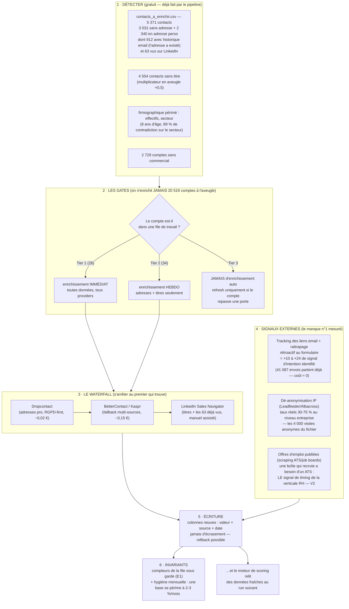

# L'architecture d'enrichissement — schéma + protocole

> Le brief : *« Le CRM a 8 ans. Rien ne garantit que ses champs sont encore vrais… Cette partie est
> un exercice d'architecture, sur schéma. »* Données fictives → aucun appel réel n'a été fait ;
> tout ce qui suit est dimensionné sur les volumes **mesurés** dans ce CRM.

**Le principe directeur, hérité du cleanup : un trou de données se répare, un refus se respecte.**
Et rien ne s'écrase jamais : chaque donnée enrichie arrive dans une colonne neuve, avec sa source
et sa date — exactement comme les colonnes `_clean` du pipeline.

## Le protocole écrit — quoi, avec quoi, quand, à quel coût

**QUOI (par ordre de valeur mesurée)**
1. **Adresses email pro** — 5 371 contacts en file, priorisés par les colonnes du livrable :
   `adresse_a_existe` (912 — les plus faciles : le CRM l'a perdue), `linkedin_vu` (63),
   `persona_tier` (décideurs d'abord), `nb_events_net` (actifs d'abord).
2. **Titres manquants** — 4 554 contacts scorés en aveugle (×0,5) ; chaque titre récupéré
   précise le multiplicateur ET le comité d'achat.
3. **Signal d'intention identifié** — le manque structurel n°1 : 95 %+ des visites d'intention
   sont anonymes. Tracking des liens + rattrapage rétroactif = ×10-24 ; dé-anonymisation IP en
   complément (30-75 % de reconnaissance réelle, pas les 90 % des plaquettes).
4. **Firmographique** (effectifs, secteur) — en dernier : utile au fit, jamais au score.

**AVEC QUOI** — waterfall « s'arrêter au premier qui trouve » : Dropcontact (RGPD, pas de base
propriétaire, idéal Europe) → BetterContact/Kaspr (fallback) → LinkedIn (titres, manuel assisté).
Signaux : n8n pour l'orchestration (tracking, webhooks), Leadfeeder/Albacross pour l'IP.

**QUAND** — jamais de batch aveugle. Les déclencheurs : entrée en Tier 1 (immédiat, complet) ·
présence en Tier 2 (hebdo, adresses+titres) · nouveau contact entrant (à l'ingestion) ·
hygiène mensuelle sur les comptes ACTIFS uniquement. Tier 3 : rien, jamais — c'est le gate
qui protège le budget.

**À QUEL COÛT** — dimensionné sur NOS volumes : file complète ≈ 5 371 × 0,02-0,15 € ≈
**110-800 € one-shot** si on la vidait — donc on ne la vide pas : gates par file →
Tier 1+2 ≈ 60 comptes ≈ **quelques euros par semaine** en régime de croisière. Le tracking
email : **coût ≈ 0** (les envois partent déjà). Budget mensuel borné en config, compteur
sous invariant — un dépassement est une alarme, pas une surprise.

**LA RÈGLE QUI NE BOUGE JAMAIS** — l'opt-out est individuel et définitif pour le canal email :
l'enrichissement peut trouver une NOUVELLE personne (et rouvrir un compte « perdu — canal mort »
proprement), il ne « répare » jamais un refus.
