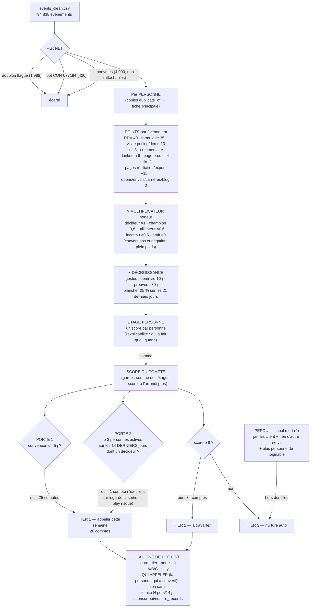

# Le scoring en un schéma — Wake the CRM (V1.1)

> Le brief : *« Un schéma de ton scoring est fortement encouragé. Si tu ne peux pas le dessiner, c'est qu'il n'est pas clair. »* Le voici.

**La logique en une phrase** : un compte devient chaud par **accumulation de preuves**, portées par les
**bonnes personnes**, **récentes** — l'entrée en liste chaude passe par deux **portes sémantiques**
(des règles, pas des points), et le score **ordonne** les files. Tout paramètre vit dans
`scoring/scoring_config.yaml`, chaque poids avec son pourquoi.

## Les règles qui ne se voient pas sur le dessin

- **Fit A/B/C** (taille dans la cible + décideur identifié) : **ordonne** la file, ne bloque jamais
  l'entrée — un C avec un RDV reste Tier 1. Départage : fit → n_records → score.
- **Le désabonnement ne touche jamais le score** : il ferme un canal (on n'écrit plus à la personne,
  on l'appelle), il ne refroidit pas un compte. Seul le cas extrême « plus personne de joignable et
  rien d'autre ne vit » sort le compte des files (9 comptes, étiquetés).
- **4 règles dormantes** documentées en config avec leurs mesures : présentes pour un vrai CRM,
  inactives ici — jamais présentées comme des protections qui auraient servi.

## Pourquoi c'est robuste

- **15 gardes automatiques** à chaque exécution (couverture des poids, flux net, somme des étages,
  unicité de la hot list, joignabilité du Tier 1, désabonné jamais en canal email…) — exécution
  rouge si une seule casse.
- **Test ±30 %** : 38 variations de poids — le **Tier 1 est stable à 100 %** (les portes sont des
  règles) ; le Tier 2 respire par construction (file de nurture à bords sensibles au seuil, assumé).
- **Où vit le scoring** : un script Python sans dépendance exotique + un YAML. Pas de base de
  données : 20 519 comptes tiennent en mémoire, le CRM reste la source de vérité, le moteur est
  re-exécutable partout (CI, cron, laptop) et chaque run régénère toutes ses sorties.
